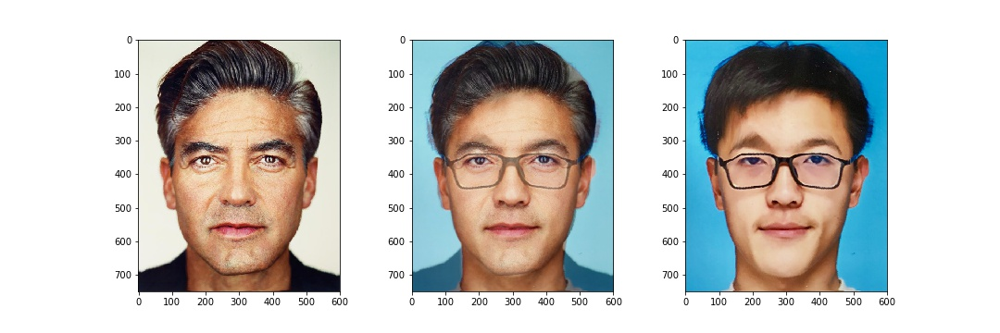
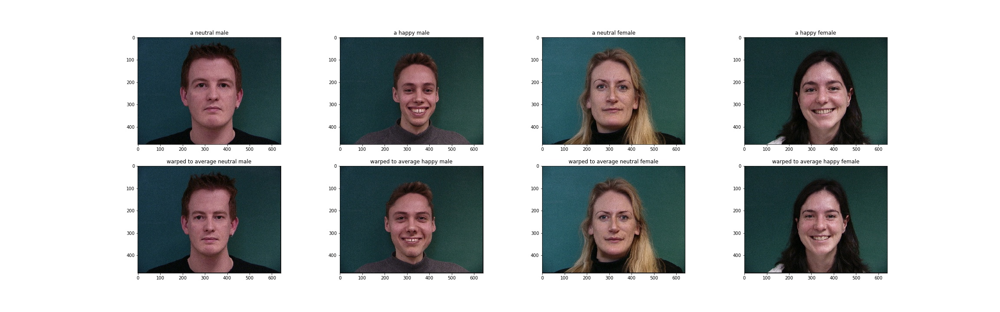
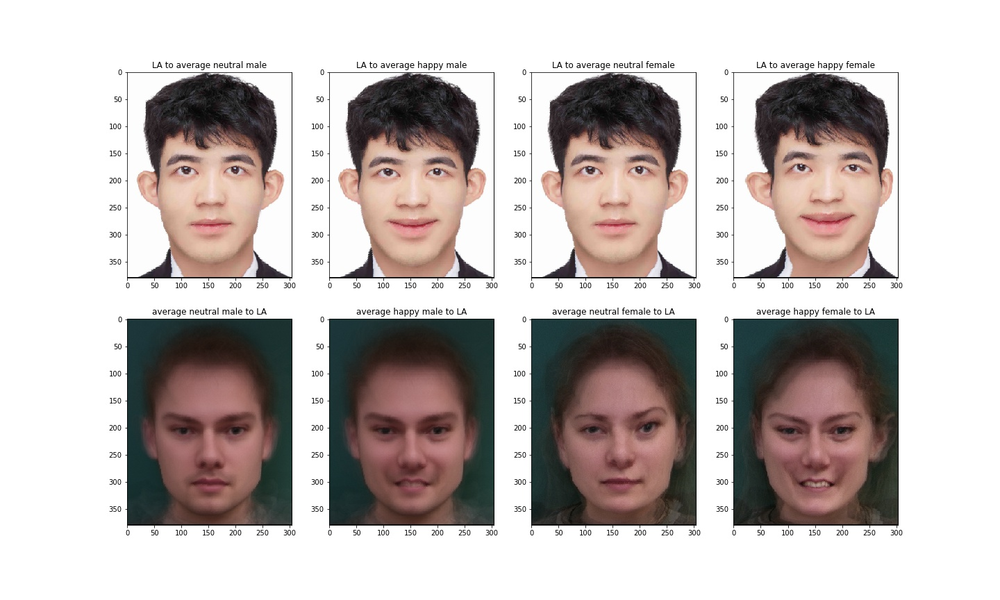

# CS194 Project 3

## Colorizing the Prokudin-Gorskii photo collection

##### Xuxin Cheng  CS194-agv

### Defining Correspondences

I included 59 point for each image including the four corners of the image. And I computed Delaunay triangulation using the mean of these point to lessen the potential triangle deformations.

### Computing the "Mid-way Face"

I calculated the transformation matrix geometrically as taught in class.

Below is the warped images and the "mid-way face".

### The Morph Sequence

|  |  |
| -------------- | ------------------- |
| fast           | slow                |

### The "Mean face" of a population

I used [IMM](http://www2.imm.dtu.dk/pubdb/views/edoc_download.php/3160/pdf/imm3160.pdf) database to compute mean faces. I choose to compute the mean faces of four different groups, neutral males; happy males; neutral females; happy females. Below is mean faces of these four groups.

Here are some examples of people warped to the mean face of their group.

Below are pictures that AO's face warped into the average geometry, and the average face warped into AO's geometry.

**Acknowledgement: thanks AO for providing his proflie photo*.

### Caricatures: Extrapolating from the mean

I extrapolate the face to a smiling face using the following formula:

​						$pts_{tgt} = \alpha*pts_{tgt} + (1-\alpha)*pts_{src}$

where $pts_{tgt}$ is our target face and $pts_{src}$ is the face to be morphed.

|     |                |
| -------------- | --------------------------------- |
| original image | extrapolated images($\alpha=1.5$) |

### Bells and Whistles

#### Change gender

I changed a male's gender to female. Here is what it looks like.

I used equation from this [paper](http://graphics.cs.cmu.edu/courses/15-463/2004_fall/www/Papers/faces.pdf). 

The shape transform can be expressed by simple parametric equations: For the *x* and *y* horizontal and vertical pixel positions of each feature point,

​										$$x_r=x_s+1(x_f-x_m)$$

where *r* denotes the resultant face, *f* denotes the first prototype (female), *m* denotes the second prototype (male), *s* denotes the source face, and 1 is the percentage of transformation to be applied.

The color transform is similar. Again, we describe each pixel position *k* as a triple by representing the RGB color values as $F(p_m, k)$ for the males, $F(p_f, k)$ for the females (both warped to the shape of the source face), and $F(s, k)$ for the source face. By adding a percentage (1) of this difference between the male and female prototypes (exactly as we did with shape), the resultant color information $F(r, k)$ becomes more female.

​						$$F(r,k)=F(s,k)+1[F(p_f,k)-F(p_m,k)]$$

#### Music Video

I used the IMM dataset to create a music video including 30 happy males.

<iframe width="420" height="315"
src="https://youtube.com/embed/C1zHizGWiUU">
</iframe>

### Conclusion

From this project I learned image transformations. The results are really cool though some of the them are still not perfect. I will learn more in the future on how to solve the remaining problems.